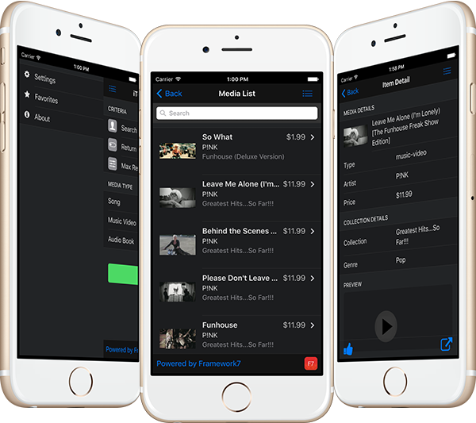

Framework7 Sample App - iTunes Media Finder
=============================================

A sample PhoneGap App built wth [Framework7](http://www.idangero.us/framework7/).

This app is the Framework7 version of the iTunes Media Explorer for sample purposes. It uses the [iTunes Search API](https://www.apple.com/itunes/affiliates/resources/documentation/itunes-store-web-service-search-api.html)
 to query different types of media based on search criteria entered and allows you to view, preview, share the items returned.

####Be sure to check out the other iTunes Media Finder apps built in different frameworks below:

- [TouchstoneJS iTunes Media Explorer (based on React)](https://github.com/hollyschinsky/phonegap-app-touchstonejs)
- [Ionic iTunes Media Explorer (based on AngularJS)](https://github.com/hollyschinsky/MediaExplorerMobile)
- [Onsen UI iTunes Media Explorer (based on AngularJS)](https://github.com/hollyschinsky/MediaExplorerMobileOnsen)

####The following plugins are used and will be fetched and added automatically upon build/run:
- [cordova-plugin-whitelist](https://www.npmjs.com/package/cordova-plugin-whitelist)
- [cordova-plugin-transport-security](https://www.npmjs.com/package/cordova-plugin-transport-security)
- [cordova-plugin-dialogs](https://www.npmjs.com/package/cordova-plugin-dialogs)
- [cordova-plugin-x-socialsharing](https://www.npmjs.com/package/cordova-plugin-x-socialsharing)
- [cordova-plugin-media](https://www.npmjs.com/package/cordova-plugin-media)

